# AccesDades_UF3
## Practica FastAPI
### Descripció Practica

En Aquesta practica em fet una API REST on influenciem les dades de una base de dades per protocol http.
 
 

# Proves
Peticio: **Get**  
Endpoint: **/product/** 
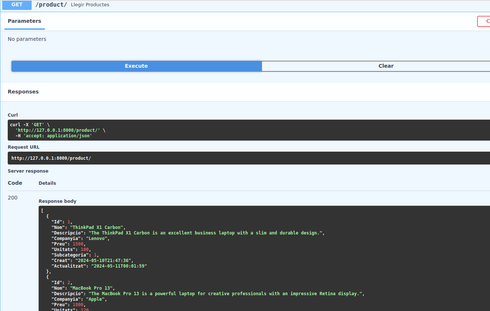

 
 

Peticio: **Get**  
Endpoint: **/product/{product_id}** 
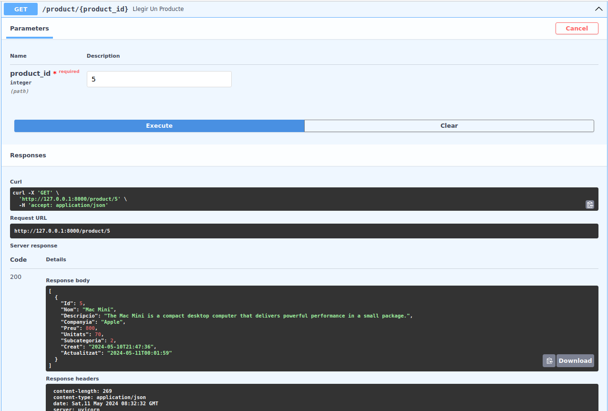

 
 

Peticio: **Post**  
Endpoint: **/product/** 
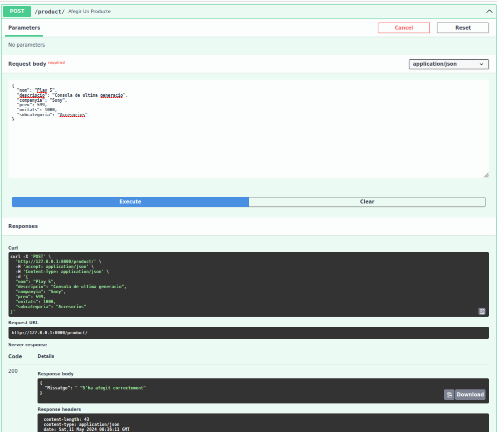

 
 

Peticio: **Put**  
Endpoint: **/product/producte/{id}** 
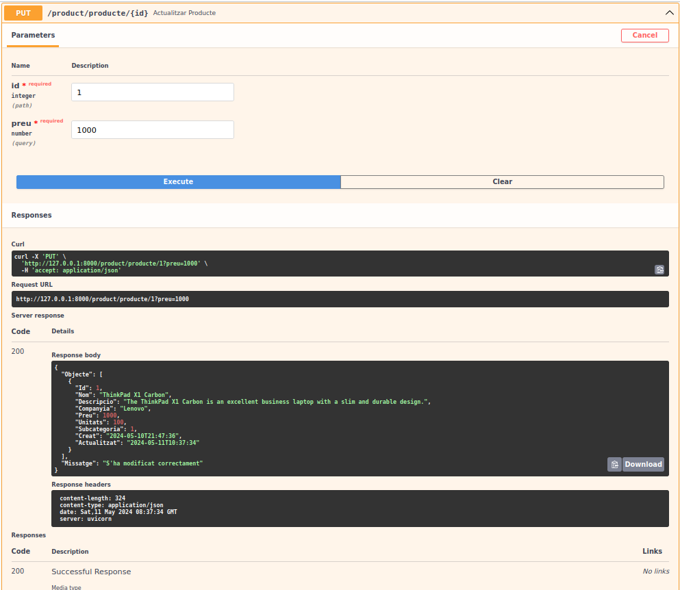

 
 

Peticio: **Delete**  
Endpoint: **/producte/{id}** 
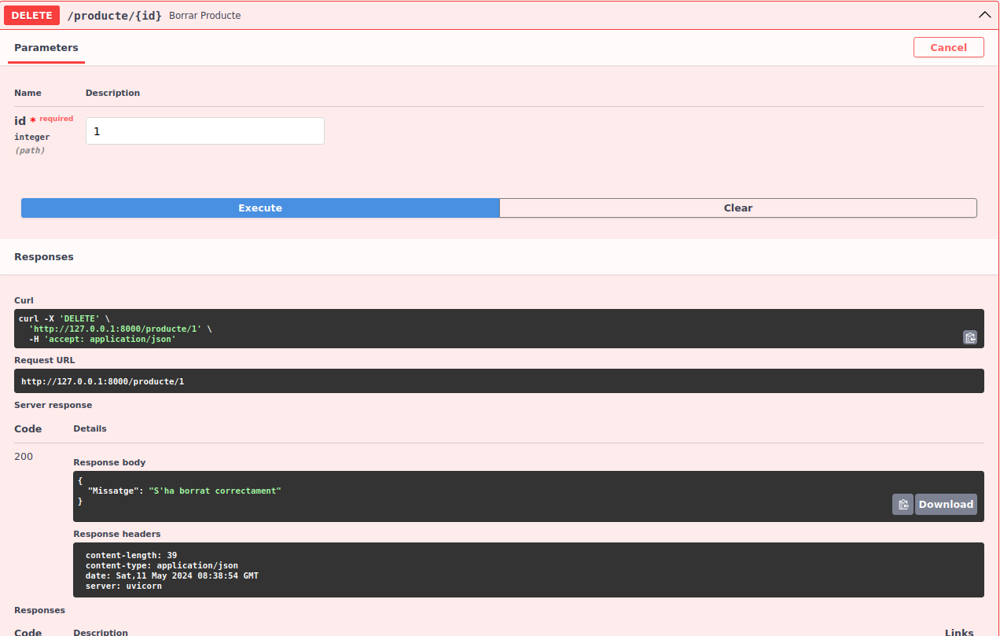

 
 

Peticio: **Get**  
Endpoint: **/productAll/** 
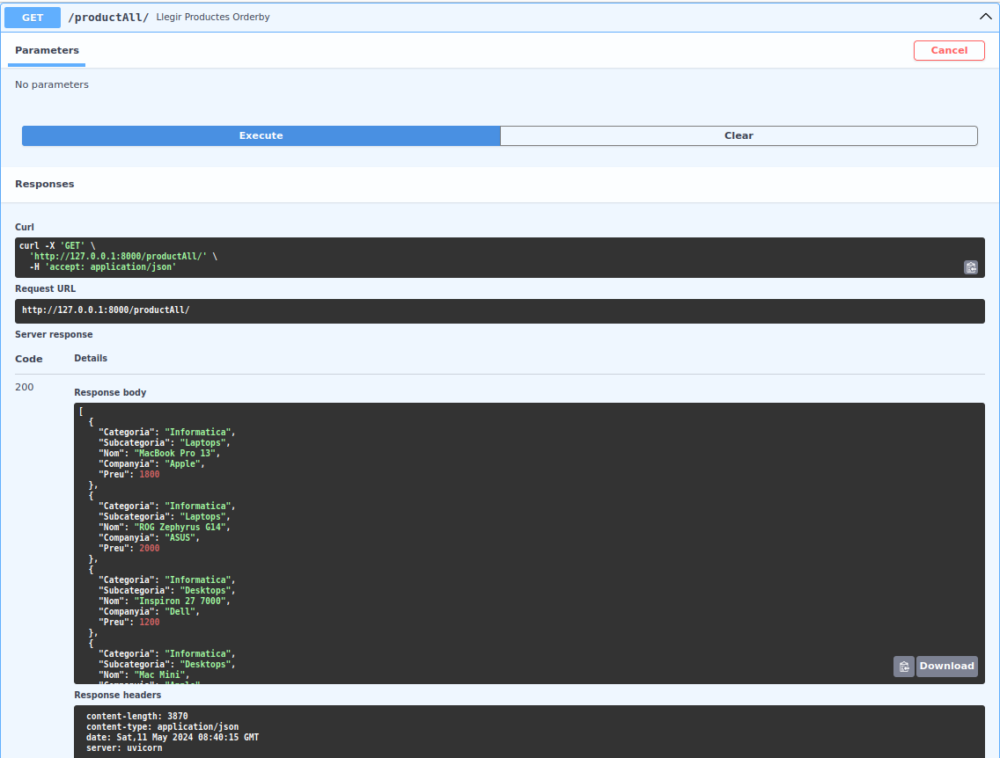

 
 

Peticio: **Get**  
Endpoint: **/productAllOrderBy/** 
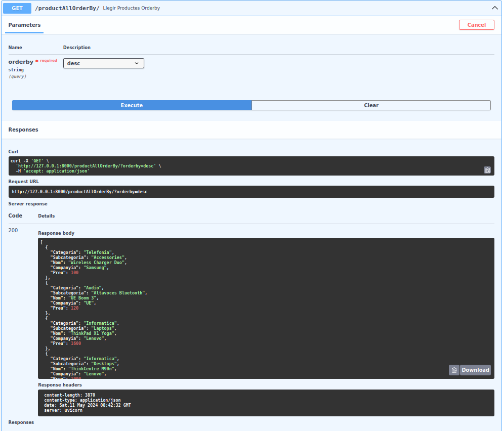

 
 

Peticio: **Get**  
Endpoint: **/productAllText/** 
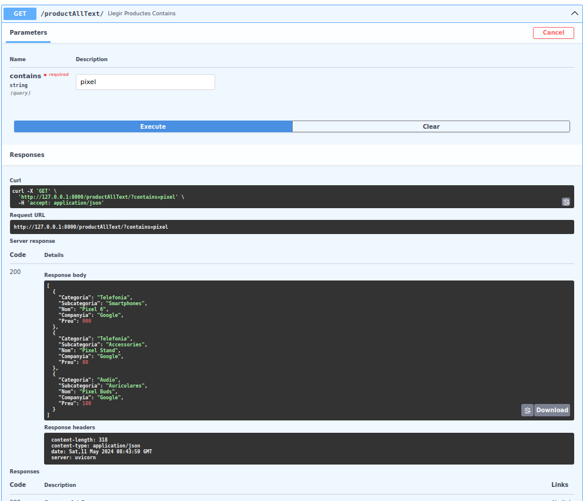

 
 

Peticio: **Get**  
Endpoint: **/productAllSkipLimit/** 
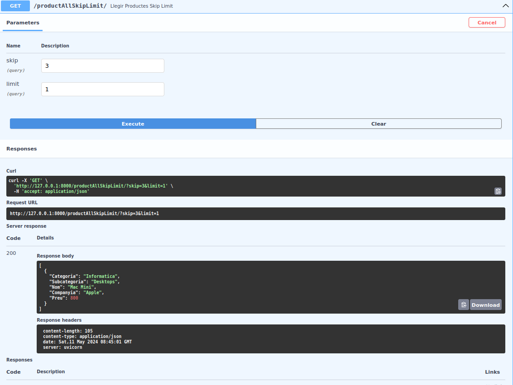

 
 

Peticio: **Post**  
Endpoint: **/loadProducts** 
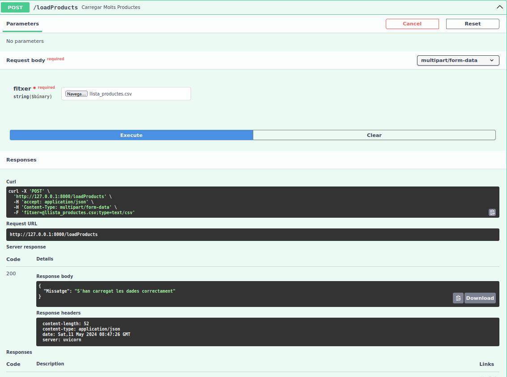

 
 

No se quina hora agafa el docs pero mostra dues hores de diferencia amb la hora amb la que es guarda el update que es la hora correcta de Espanya.
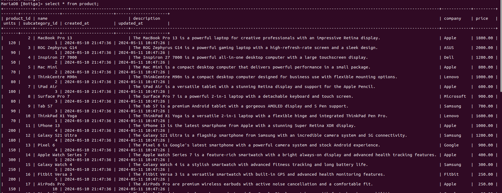